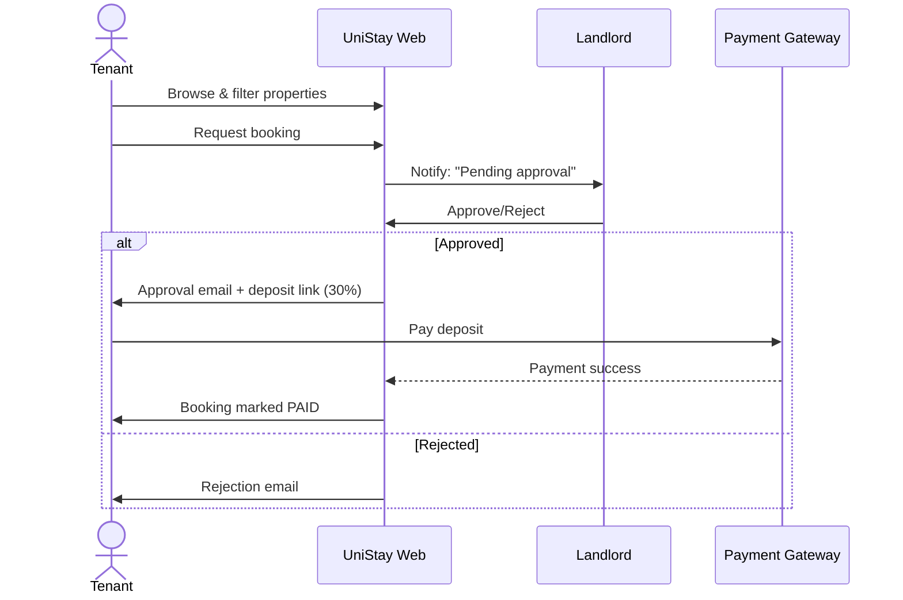

<div align="center">


# UniStay Website 🏡🎓

**A student accommodation marketplace for listings, bookings, deposits, and reviews.**

[](#)
[](#)
[](#license)
[](#credits)

<br/>

<a href="#-quick-start">🚀 Quick Start</a> ·
<a href="#-features">✨ Features</a> ·
<a href="#-screens--flows">🧭 Flows</a> ·
<a href="#-security">🔐 Security</a> ·
<a href="#-project-structure">🗂️ Structure</a>

</div>

---

> **Tip:** This README is a dev-friendly quickstart. For the full **Business Rules** and **User Guide**, see `/docs` or the PDFs you shared.  

---

## 📌 Overview

**UniStay** connects **tenants (students)** with **landlords**. Tenants discover rooms, request bookings, pay a **30% deposit** once approved, chat with landlords, and leave reviews. Landlords onboard properties, manage bookings, and track status.

---

## ✨ Features

- 🔐 **Auth & Roles** — tenant, landlord, admin; email verification, lockouts on repeated failures.
- 🏠 **Property Management** — create, edit, publish/unpublish, upload images, set availability.
- 🔎 **Search & Filters** — city/title keyword, price range, room type.
- 📝 **Bookings** — request → approve/reject → pay deposit → complete.
- 💳 **Payments** — one-per-booking; booking becomes **Paid** after deposit confirmation.
- 💬 **Messaging** — in-app, safe negotiation channels.
- ⭐ **Reviews** — post-stay ratings; moderation before publish.
- 🛡️ **Admin** — moderate content, view logs, usage analytics.

> Business rule highlights: unique emails, verified accounts, no landlord self-bookings, duplicate tenant+property bookings blocked, strict status flow & logging.

---

## 🧑‍⚖️ Roles & Permissions

| Role      | Can do                                                                                   |
|-----------|--------------------------------------------------------------------------------------------|
| Tenant    | Search, request bookings, pay deposits, message, review after stay                        |
| Landlord  | Add/manage listings, approve/reject requests, manage availability, message                |
| Admin     | Moderate reviews/listings, view activity logs & reports (no creation of bookings/listings) |

---

## 🧩 Domain Model (ERD Preview)

```mermaid
erDiagram
  USER ||--o{ BOOKING : makes
  USER ||--o{ PROPERTY : owns
  PROPERTY ||--o{ BOOKING : reserves
  BOOKING ||--|| PAYMENT : "has one"
  BOOKING ||--o{ REVIEW : "can have"
  USER ||--o{ MESSAGE : sends
  USER ||--o{ MESSAGE : receives

  USER {
    int id PK
    string role  "TENANT|LANDLORD|ADMIN"
    string name
    string email UNIQUE
    string password_hash
    bool verified
  }

  PROPERTY {
    int id PK
    int landlord_id FK
    string title
    string city
    decimal price
    string status  "PUBLISHED|UNPUBLISHED"
  }

  BOOKING {
    int id PK
    int property_id FK
    int tenant_id FK
    date start_date
    date end_date
    string status "PENDING|APPROVED|REJECTED|PAID|COMPLETED"
  }

  PAYMENT {
    int id PK
    int booking_id FK
    decimal amount
    string method
    datetime paid_at
    string ref
  }

  REVIEW {
    int id PK
    int booking_id FK
    tinyint rating
    string comment
    string moderation "PENDING|APPROVED|REJECTED"
  }

  MESSAGE {
    int id PK
    int sender_id FK
    int recipient_id FK
    text body
    datetime created_at
  }
```

---

## 🚀 Quick Start

> **Local Dev (XAMPP / LAMP)**

```bash
# 1) Place the repo under your web root
# Windows: C:\xampp\htdocs\unistay
# macOS:   /Applications/XAMPP/htdocs/unistay

# 2) Create DB in phpMyAdmin
# Name: unistay

# 3) Copy .env.example to .env and update values
# 4) Import database/schema.sql and database/seed.sql (if present)
# 5) Visit http://localhost/unistay
```

<details>
<summary><b>Alternative: PHP built-in server</b></summary>

```bash
php -S localhost:8000 -t public
# then open http://localhost:8000
```
</details>

---

## 🔧 Environment Variables

```ini
APP_ENV=local
APP_DEBUG=true
APP_URL=http://localhost/unistay

DB_HOST=127.0.0.1
DB_PORT=3306
DB_DATABASE=unistay
DB_USERNAME=root
DB_PASSWORD=

MAIL_HOST=smtp.mailtrap.io
MAIL_PORT=2525
MAIL_USERNAME=your_user
MAIL_PASSWORD=your_pass
MAIL_FROM_ADDRESS=no-reply@unistay.local
MAIL_FROM_NAME="UniStay"

PAYMENT_GATEWAY=mock
PAYMENT_PUBLIC_KEY=pk_test_xxx
PAYMENT_SECRET_KEY=sk_test_xxx
```

> **Prod notes:** Disable debug, enforce HTTPS, rotate keys, and back up DB & storage.

---

## 🗃️ Database & Seed Data

- **Schema**: `database/schema.sql` (users, properties, bookings, payments, messages, reviews)
- **Seed**  : `database/seed.sql` (demo accounts, sample properties, example bookings)

> No SQL files yet? Export your current DB or generate migrations to match the ERD.

---

## 🧭 Screens & Flows



---

## 🧪 Test Accounts (sample)

- **Tenant** → `tenant@example.com` / `Tenant!234`  
- **Landlord** → `landlord@example.com` / `Landlord!234`  
- **Admin** → `admin@example.com` / `Admin!234`

> Replace with your seeded users.

---

## 🔐 Security

- Strong server-side validation on every form (reject empty/invalid).
- Passwords hashed; sensitive fields encrypted at rest.
- CSRF protection where applicable; session timeout on inactivity.
- Account lockouts after repeated failed logins.
- Audit logging for bookings & payments (user ID + timestamp).
- Legal: ToS/Privacy acceptance; listings should meet local housing/safety laws.

---

## 🧾 Logs & Reports

- Action logs for bookings/payments.
- Monthly activity & revenue snapshots.
- Property performance analytics (views → bookings → reviews).

---

## 🗂️ Project Structure

```
unistay/
├─ public/                 # index.php, assets
├─ app/                    # controllers, models, services
├─ resources/              # views/templates, emails
├─ database/               # schema.sql, seed.sql
├─ storage/                # logs, uploads
├─ config/                 # env & app config
├─ docs/                   # Business Rules, User Guide, ERD, images
└─ README.md
```

---

## 🧑‍💻 Contributing

- Branch: `git checkout -b feature/<name>`  
- Commit: `git commit -m "feat: concise summary"`  
- PR: open, request review, pass checks.

**Guidelines**  
- Keep controllers thin; move rules to services/policies.  
- Validate inputs centrally.  
- Add tests for booking status flow, payments, and review moderation.  
- Avoid duplicating business logic across controllers/views.

---

## ✅ Release Checklist

- [ ] All forms validated server-side
- [ ] Booking status transitions tested
- [ ] Deposit captured (30%) and receipt generated
- [ ] Email/SMS templates verified
- [ ] Admin moderation working
- [ ] Logs capture user + timestamp
- [ ] Backups configured

---

## 📚 Docs

- `/docs/UniStay_Business_Rules_WO2.pdf`  
- `/docs/Group_WO2_System Documentation.docx`  
- `/docs/Group_WO2_User Guide.pdf`  

> If your PDFs live elsewhere, place copies into `/docs` for easy access.

---

## 📜 License

This project is for educational purposes (course submission).  
Add an explicit license if open-sourcing later.

---

## 🙌 Credits

**Team WO2 — UniStay Website**  
Lecturer/Module: PRT372S  
Docs: Business Rules, User Guide, ERD

---

<sub>Made with ❤️ by Sanele Trueman Zondi</sub>
